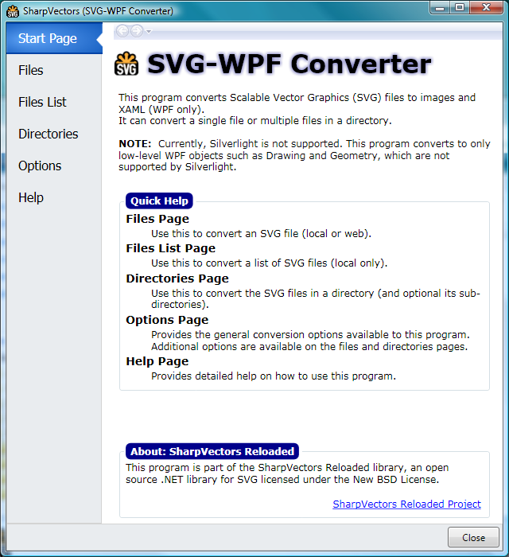
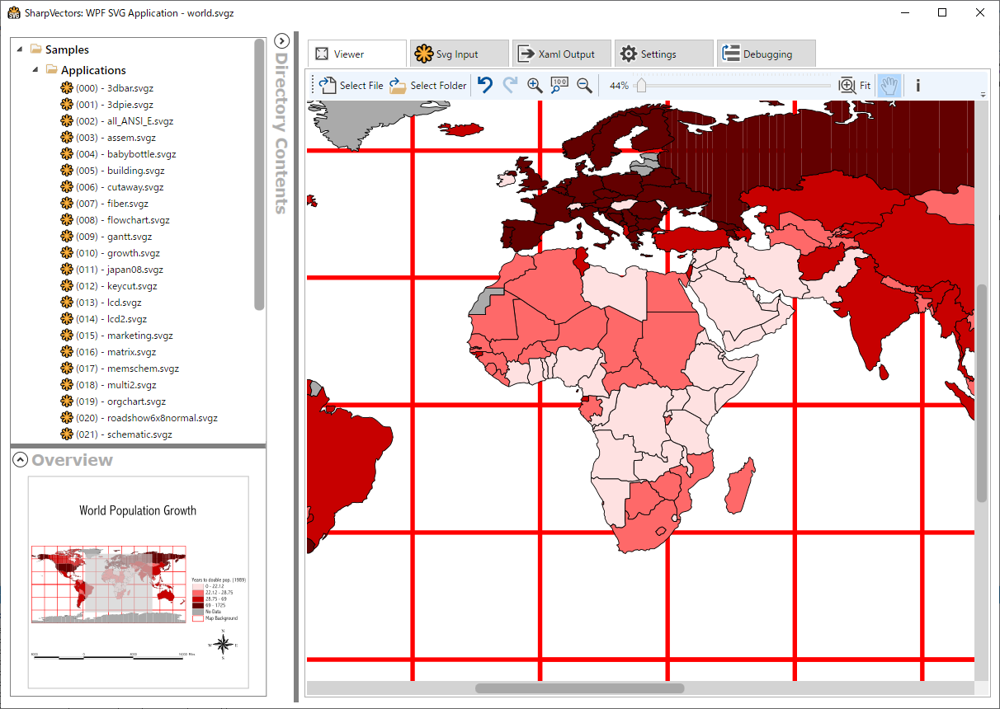
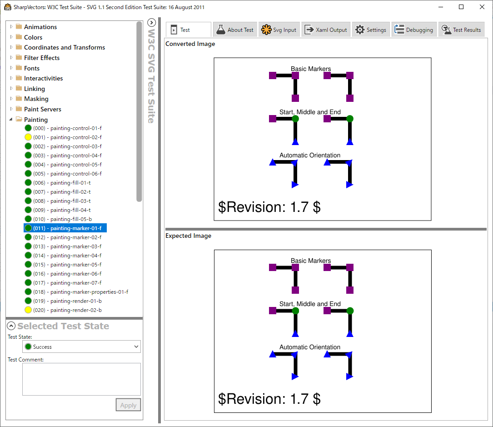

## Project Description
The Scalable Vector Graphics (SVG) is an XML-based standard file format for creating graphics on the web, and is supported by most modern browsers.
This project provides a C# library for parsing, converting and viewing the SVG files in WPF applications.

The [Scalable Vector Graphics (SVG)](http://en.wikipedia.org/wiki/Scalable_Vector_Graphics) is now natively supported in most internet browsers, including the IE 9. With the HTML5, the use of the SVG as graphics format on the web is increasing. 

For .NET application developers, there is currently no library complete enough to handle SVG files. Even the commercial tools are either not available or not complete enough to handle most uses of the SVG in Windows Presentation Foundation (WPF) applications.
The project does not aim to provide a complete implementation of the SVG file format, but will support the features required in an average graphics application.

The SVG specification is available in [HTML](https://www.w3.org/TR/SVG11/) format or the [PDF](https://www.w3.org/TR/SVG11/REC-SVG11-20110816.pdf) format.

This project is based on the [SharpVectorGraphics (aka SVG#)](http://sourceforge.net/projects/svgdomcsharp/) library. Besides bug fixes and improved feature support, we updated it to .NET 3.5 initially and now to NET 4.x platform, removing the dependencies on the depreciated script engine libraries and the zip library, SharpZipLib.

## Features and Uses
In general, the following features are implemented:
* Parsing of the SVG files to create the SVG DOM
* SVG to XAML conversion
* A small runtime library to handle font URI, embedded images and others when using the XAML files directly from disk.
* An optimized XAML output.
* A simple and basic SVG viewer (an advanced viewer is planned).
* Interaction with the conversion process (by a visitor pattern) to allow for custom hyper-link implementations, font substitutions etc.
**NOTE**: Only Geometry/Drawing level elements are exported, which will not work with Silverlight. 
See the [Documentation](Docs/Documentation.md) section for more information on the features.

## Installation
The SharpVectors a .NET 4.0 or up library and applications. The library can be used in WPF and Windows Forms applications.

### For the Library
Install the latest released version from NuGet, the [Version 1.1.0.0](https://www.nuget.org/packages/SharpVectors.Reloaded/). 

### For the Applications
Download the latest released version from GitHub Releases Page, the [Version 1.1.0.0](https://github.com/ElinamLLC/SharpVectors/releases).

## Converter Application
There is a converter application. It converts a single SVG file, multiple SVG files and directory of SVG files to XAML.

## Sample Applications
The library includes a number of sample application for both WPF and GDI+. Here are some of them:

### WPF Test Application
This is an application for browsing directory (recursively) of SVG files.

### WPF W3C Test Suite
This is an application for viewing the W3C Test Suite compliant results. It has two panes: top and bottom. The top pane is the generated WPF output, the bottom pane is the W3C expected output image.
By the test results, this is the most complete SVG reader for WPF.

