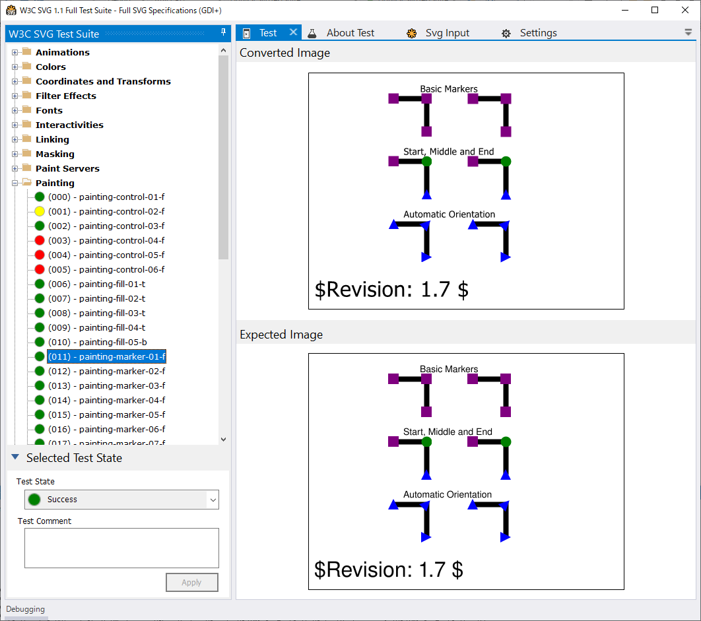

## Project Description
The Scalable Vector Graphics (SVG) is an XML-based standard file format for creating graphics on the web, 
and is supported by most modern browsers.
This project provides a C# library for parsing, converting and viewing the SVG files in WPF applications.

The [Scalable Vector Graphics (SVG)](http://en.wikipedia.org/wiki/Scalable_Vector_Graphics) is now natively 
supported in most internet browsers, including the IE 9. With the HTML5, the use of the SVG as graphics 
format on the web is increasing. 

For .NET application developers, there is currently no library complete enough to handle SVG files. 
Even the commercial tools are either not available or not complete enough to handle most uses of 
the SVG in Windows Presentation Foundation (WPF) applications.
The project does not aim to provide a complete implementation of the SVG file format, but will 
support the features required in an average graphics application.

The SVG specification is available in [HTML](https://www.w3.org/TR/SVG11/) format or the [PDF](https://www.w3.org/TR/SVG11/REC-SVG11-20110816.pdf) format.

## Features and Uses
In general, the following features are implemented:
* Parsing of the SVG files to create the SVG DOM
* SVG to XAML conversion
* A small runtime library to handle font URI, embedded images and others when using the XAML files directly from disk.
* An optimized XAML output.
* A simple and basic SVG viewer (an advanced viewer is planned).
* Interaction with the conversion process (by a visitor pattern) to allow for custom hyper-link implementations, font substitutions etc.

**NOTE**: Only Geometry/Drawing level elements are exported, which will not work with Silverlight. 
See the [Documentation](Docs/Documentation.md) section for more information on the features.

## Installation
The SharpVectors library targets the following frameworks
* .NET Framework, Version 4.0
* .NET Framework, Version 4.5
* .NET Framework, Version 4.6
* .NET Framework, Version 4.7
* .NET Framework, Version 4.8
* .NET Standard, Version 2.1
* .NET Core, Version 3.1
* .NET 5.0

The library can be used in WPF and Windows Forms applications.

### For the Library
The library can be downloaded from the following sources
* **NuGet**, [Version 1.7.0.0 - SharpVectors](https://www.nuget.org/packages/SharpVectors/). 
* **NuGet**, [Version 1.7.0.0 - SharpVectors.Reloaded](https://www.nuget.org/packages/SharpVectors.Reloaded/). 
* **GitHub Releases Page**, [Version 1.7.0.0](https://github.com/ElinamLLC/SharpVectors/releases).

## Documentation
An introduction and a tutorial with sample are available. See the [Documentation](Docs/Documentation.md) section for more information.

## Sample Applications
The library includes a number of sample application for both WPF and GDI+. Here are some of them:

### WPF Test Application
This is an application for browsing directory (recursively) of SVG files.

### WPF W3C Test Suite
This is an application for viewing the W3C Test Suite compliant results. It has two panes: top and bottom. 
The top pane is the generated WPF output, the bottom pane is the W3C expected output image.
By the test results, this is the most complete SVG reader for WPF!

### GDI+ W3C Test Suite
This is an application for viewing the W3C Test Suite compliant results. It has two panes: top and bottom. 
The top pane is the generated GDI+ output, the bottom pane is the W3C expected output image.

## Tutorial Samples
A number of tutorial samples are available in the [TutorialSamples](https://github.com/ElinamLLC/SharpVectors/tree/master/TutorialSamples) folder.

## Credits
SharpVectors uses source codes from articles and other open source projects. We wish to acknowledge and thank 
the authors of these great articles and projects
* [SharpVectorGraphics (aka SVG#)](https://sourceforge.net/projects/svgdomcsharp/) by SVG# Team of Developers (SourceForge)
* [WPF Zooming and Panning Control](https://www.codeproject.com/KB/WPF/zoomandpancontrol.aspx) by Ashley Davis (CodeProject)
* [Render Text On A Path With WPF](https://msdn.microsoft.com/en-us/magazine/dd263097.aspx) by Charles Petzold (MSDN Magazine - December 2008)
* [MinIoC](https://github.com/microsoft/MinIoC) by Microsoft (Single-file minimal C# IoC container)
* [.NET ZLib Implementation](https://www.codeproject.com/Tips/830793/NET-ZLib-Implementation) by Alberto M (CodeProject)
* [Brotli compression format](https://github.com/google/brotli) by Google (C# Decoder)

## Related Projects
The following are related SVG viewer projects for the .NET platforms
* [SVG](https://github.com/vvvv/SVG) for GDI+
* [SVGImage](https://github.com/dotnetprojects/SVGImage) for WPF

## Related Repositories
The following are related SharpVectors repositories
* [SharpVectors-TestSuites](https://github.com/ElinamLLC/SharpVectors-TestSuites) : The W3C Test Suite files used by the SharpVectors for testing.
* [SharpVectors-SvgXaml](https://github.com/ElinamLLC/SharpVectors-SvgXaml) : SharpVectors based SVG to XAML converter application.
* [SharpVectors-SvgViewer](https://github.com/ElinamLLC/SharpVectors-SvgViewer) : SharpVectors based SVG viewer application.

