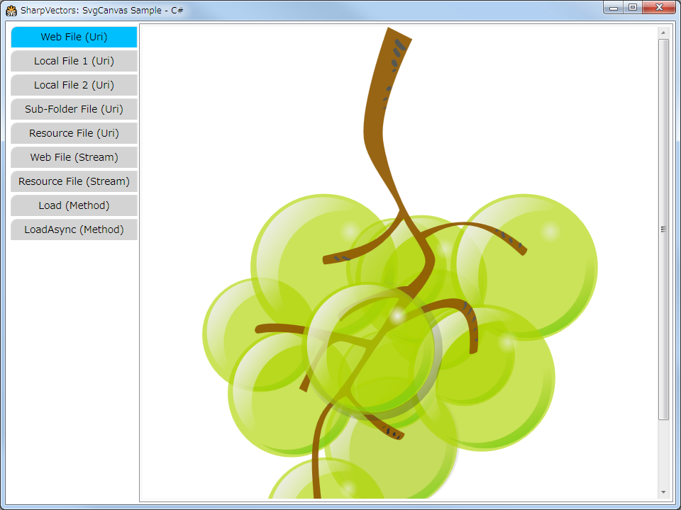
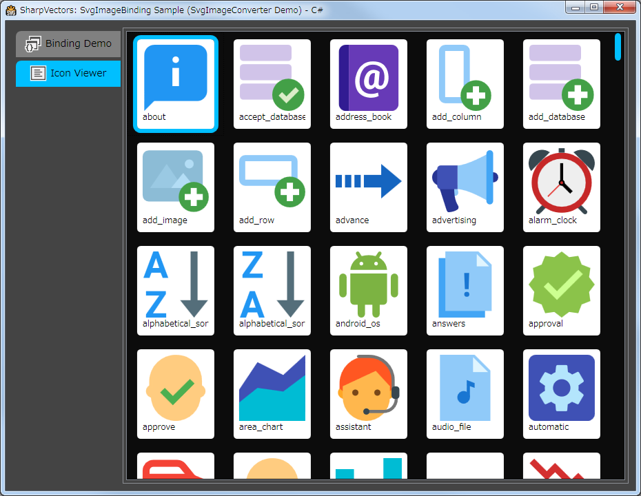
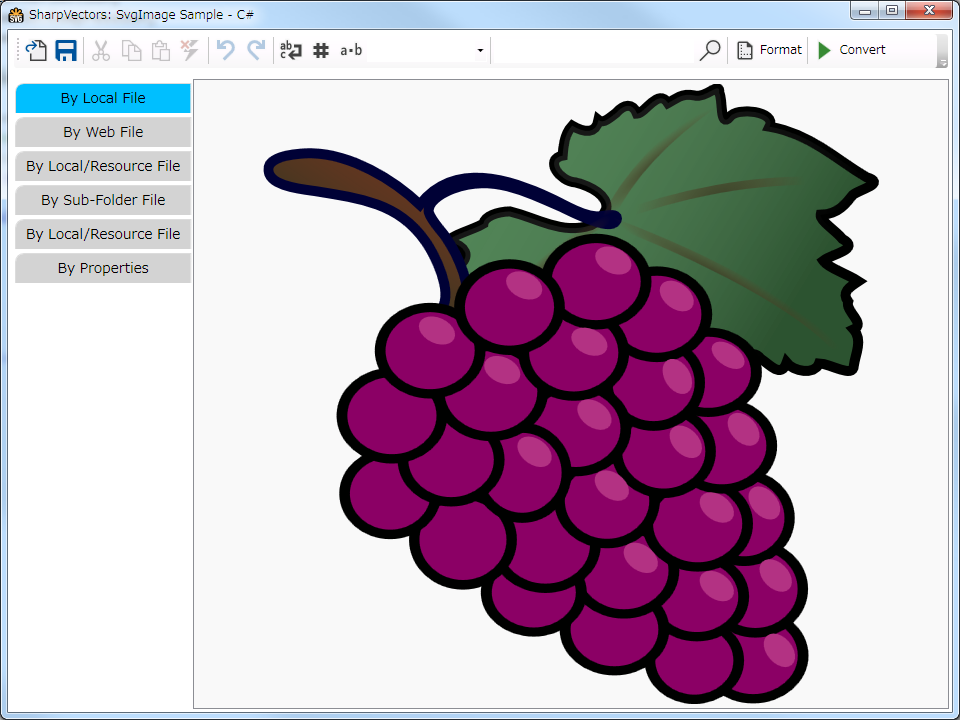
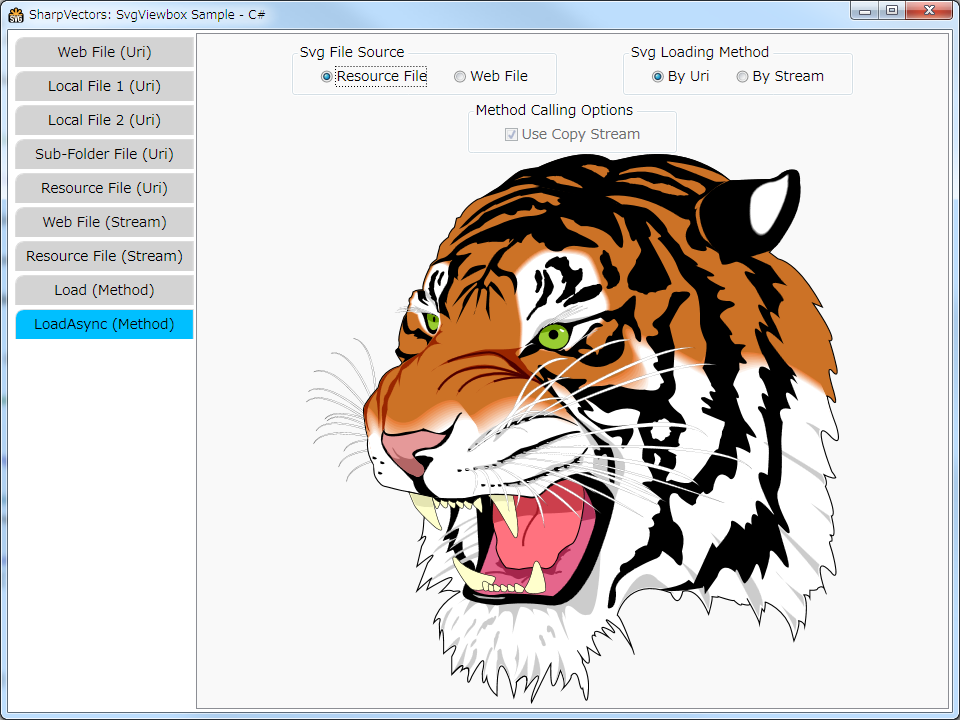

## Control Samples - WPF
This directory contains various WPF projects in C# and VB.NET demonstrating the controls and markup-extensions provided by the SharpVectors libraries.

The C# and VB.NET samples are similar, feel same and function the same. The VB.NET projects have "VB" suffix in the project names.

These samples are simple, independent and do not require third-party libraries or packages.

All the samples reference the assemblies in the **SharpVectors\Output** folder.


## SvgCanvasSample and SvgCanvasSampleVB

These are samples demonstrating the **SvgCanvas** implementation provided by the SharpVectors.



The various tabs demonstrate different ways to set and render SVG sources

* **Web File (Uri)**: Demonstrates setting Web SVG sources by the URI to the file. 
  Uses ```SvgCanvas.Source``` dependency property.
* **Local File 1 (Uri)**: Demonstrate setting local SVG sources by the URI to the file (the file is in parent directory). 
  Uses ```SvgCanvas.Source``` dependency property.
* **Local File 2 (Uri)**: Demonstrate setting local SVG sources by the URI to the file (the file is in the same directory). 
  Uses ```SvgCanvas.Source``` dependency property.
* **Sub-Folder File (Uri)**: Demonstrate setting local SVG sources by the URI to the file (the file is in a sub-directory). 
  Uses ```SvgCanvas.Source``` dependency property.
* **Resource File (Uri)**: Demonstrate setting resource SVG source (in the same assembly) by the URI to the file (relative path). 
  Uses ```SvgCanvas.Source``` dependency property.
* **Web File (Stream)**: Demonstrates setting Web SVG sources by the stream to the file (accessed in code through HttpWebRequest and HttpWebResponse classes).
   Uses ```SvgCanvas.StreamSource``` dependency property.
* **Resource File (Stream)**: Demonstrate setting resource SVG source (in the same assembly) by the stream to the file (accessed in code through Application.GetResourceStream(Uri) method).
   Uses ```SvgCanvas.StreamSource``` dependency property.
* **Load (Method)**: Demonstrate using the Load method to access and render SVG sources using both URI and stream sources. Optional asynchronous access is also demonstrated, a form suitable for .NET 4.0.
* **LoadAsync (Method)**: Demonstrate using the LoadAsync asynchronous method to access and render SVG sources using both URI and stream sources. This uses the async/await keywords supported in .NET 4.5 or later.


## SvgImageBindingSample and SvgImageBindingSampleVB

These samples demonstrate how to use the **SvgImageConverter** markup extension, which is similar to the **SvgImage** markup extension (discussed below) but implements [IValueConverter](https://docs.microsoft.com/en-us/dotnet/api/system.windows.data.ivalueconverter) interface to support data bindings.



The various tabs demonstrate different ways to set and render SVG sources. It has two [Pages](https://docs.microsoft.com/en-us/dotnet/api/system.windows.controls.page) in a tab control.

* **TabControl Items Icons**: The images in the [TabControl](https://docs.microsoft.com/en-us/dotnet/api/system.windows.controls.tabcontrol) items are SVG images sources in the resources of the assembly. SvgImage markup extension could also be used here.
* **Binding Demo Page**: Demonstrates various binding sources:
      * From a dependent property defined on the code-behind of the page.
      * From a resource file in the same assembly.
      * From a content of a [TextBox](https://docs.microsoft.com/en-us/dotnet/api/system.windows.controls.textbox) control on the same page.
* **Icon Viewer Page**: The uses [ListView](https://docs.microsoft.com/en-us/dotnet/api/system.windows.controls.listview) control to demonstrate the binding from a [DataContext](https://docs.microsoft.com/en-us/dotnet/api/system.windows.frameworkelement.datacontext) dependency property set in the code-behind of the pages.
  The SVG icons are provided in the output directory as Zip file, which is automatically unzipped and enumerated to create the data source.


### SvgImageSample and SvgImageSampleVB

These samples demonstrate how to use the **SvgImage** markup extension.



The various tabs demonstrate different ways to set and render SVG sources.

* **Toolbar Icons**: The toolbar images are created from SVG sources stored as resource files. This is suitable  for [High DPI Desktop Application Development](https://docs.microsoft.com/en-us/windows/desktop/hidpi/high-dpi-desktop-application-development-on-windows). The toolbar itself is not used in the sample, only for demonstration of the icons.
* **TabControl Page Images**: Demonstrate various means to set local, web and resource files.


### SvgViewboxSample and SvgViewboxSampleVB

These are samples demonstrating the **SvgViewbox** implementation provided by the SharpVectors.



The various tabs demonstrate different ways to set and render SVG sources

- **Web File (Uri)**: Demonstrates setting Web SVG sources by the URI to the file. 
  Uses ```SvgViewbox.Source``` dependency property.
- **Local File 1 (Uri)**: Demonstrate setting local SVG sources by the URI to the file (the file is in parent directory). 
  Uses ```SvgViewbox.Source``` dependency property.
- **Local File 2 (Uri)**: Demonstrate setting local SVG sources by the URI to the file (the file is in the same directory). 
  Uses ```SvgViewbox.Source``` dependency property.
- **Sub-Folder File (Uri)**: Demonstrate setting local SVG sources by the URI to the file (the file is in a sub-directory). 
  Uses ```SvgViewbox.Source``` dependency property.
- **Resource File (Uri)**: Demonstrate setting resource SVG source (in the same assembly) by the URI to the file (relative path). 
  Uses ```SvgViewbox.Source``` dependency property.
- **Web File (Stream)**: Demonstrates setting Web SVG sources by the stream to the file (accessed in code through HttpWebRequest and HttpWebResponse classes).
   Uses ```SvgViewbox.StreamSource``` dependency property.
- **Resource File (Stream)**: Demonstrate setting resource SVG source (in the same assembly) by the stream to the file (accessed in code through Application.GetResourceStream(Uri) method).
   Uses ```SvgViewbox.StreamSource``` dependency property.
- **Load (Method)**: Demonstrate using the Load method to access and render SVG sources using both URI and stream sources. Optional asynchronous access is also demonstrated, a form suitable for .NET 4.0.
- **LoadAsync (Method)**: Demonstrate using the LoadAsync asynchronous method to access and render SVG sources using both URI and stream sources. This uses the async/await keywords supported in .NET 4.5 or later.


